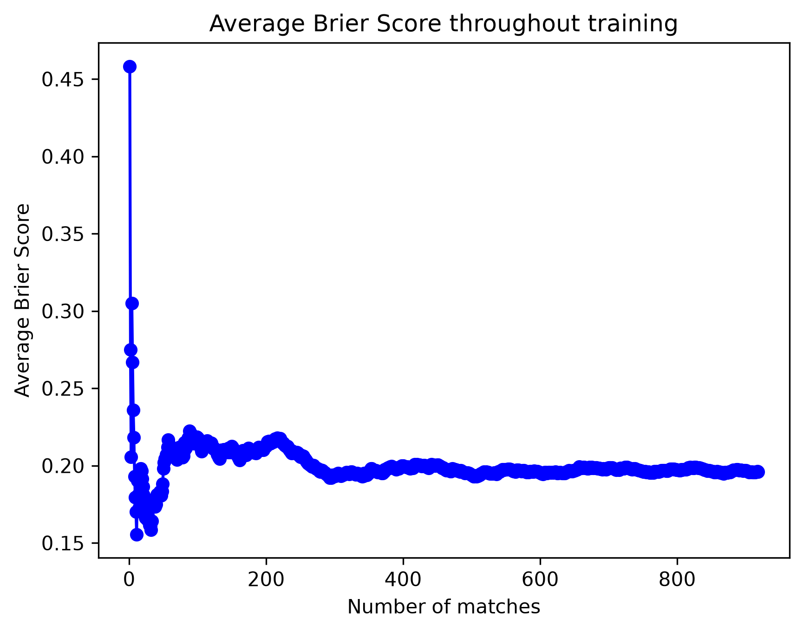

**The Elo model's cumulative Brier score finishes at approximately 0.196, below the constant 50/50 baseline of 0.250.** This corresponds to roughly 22% lower mean squared prediction error over the plotted verification period. Lower Brier scores indicate better probabilistic predictions.

The figures below are estimates read from the chart. `outputs/evaluation.csv` records the exact scores, evaluated and skipped match counts, and the training-end and verification-start dates for the run.

| Measure | Result |
|---|---:|
| Elo Brier score | Approximately 0.196 |
| 50/50 baseline Brier score | 0.250 |
| Absolute improvement: baseline minus Elo | Approximately +0.054 |
| Relative reduction in Brier score | Approximately 22% |
| Decisive matches shown | Roughly 900 |

The project uses Cricsheet men's T20 international match data. The chronological split used in the project walkthrough trains on matches before 1 January 2025 and verifies on matches dated 1 January 2025 or later. The report assumes the chart was generated from that run's verification predictions.

During verification, each prediction is recorded before applying that match's result to the team ratings. Ratings then update as later results become available. Both metrics use the same decisive matches. Ties update Elo ratings and match counts but are excluded from the binary Brier score; no-results affect neither the ratings nor the score.

Each point averages the errors from all decisive verification matches evaluated up to that point. The curve fluctuates sharply at the beginning, when individual results have a large influence on the average. It falls below 0.250 early and remains below that level for the rest of the plotted period. Over the final several hundred matches, the cumulative score stays close to 0.20.

This result suggests that the Elo ratings capture useful differences in team strength compared with assigning both teams equal probability in this period. The smoother tail also reflects the stabilising effect of cumulative averaging; it does not by itself establish that the predicted probabilities are well calibrated.

The comparison covers one chronological split and a simple baseline. The model uses match outcomes and team ratings, without explicit information about venues, player availability, lineups, or conditions. Further evaluation across different periods and against stronger baselines would help assess how consistently the improvement holds.
